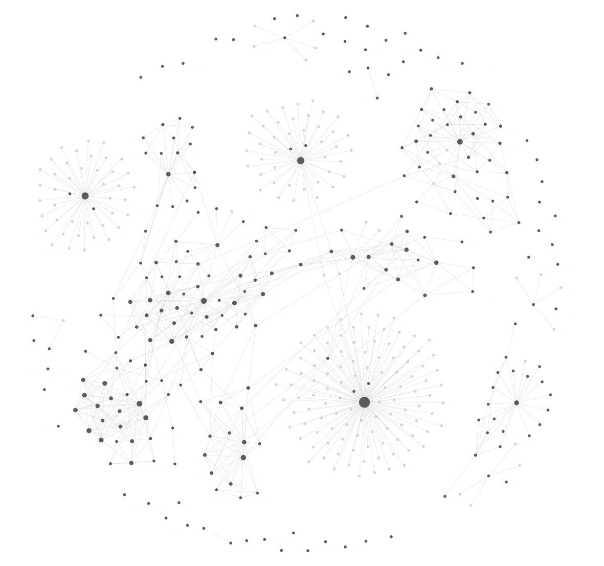

[中文](README.zh-CN.md)

# 🗂 obsidian-organize

> Let Claude organize your Obsidian notes in one sentence — auto-categorize, tag, link, and update indexes



▲ Organized Obsidian knowledge graph — PARA classification + auto-generated bidirectional links

## Why obsidian-organize?

As your notes grow, things get messy:

- 📁 Hundreds of files dumped in one folder, impossible to find anything
- 🏷 You want tags but never bother to categorize manually
- 🔗 You know your notes are related but never create links
- 📑 You want MOC indexes but always forget to update them

**obsidian-organize automates all of this.**
Just tell Claude "organize my notes", and it will:

1. Read and understand content, auto-classify into PARA folders
2. Generate complete frontmatter (title, category, tags, summary)
3. Find related notes and add bidirectional links
4. Update the corresponding MOC index page

Each note gets its own git commit — easy to roll back anytime.

## ✨ Three Modes

### Rewrite — "simplify this note"

Strip redundancy, keep core logic and code examples. Original auto-backed up to Archives.

### Organize — "organize note"

Auto-classify → generate metadata → move to folder → add bidirectional links → update MOC.

### Generate — "generate a note about XXX"

Four input sources:

- 💬 Give a topic, generate from scratch
- 🗣 Turn the current conversation into a note
- 🔗 Fetch content from a URL and generate
- 📋 Paste content and organize into a note

After generation, the full organize pipeline runs automatically (classify + link + MOC).

## 📸 Before & After

### Before

```
vault/
├── random-thoughts.md
├── study-notes.md
├── interview-prep.md
├── some-ideas.md
├── proxy-explained.md
└── ...(200+ notes scattered in root)
```

### After

```
vault/
├── Areas/
│   ├── networking/
│   ├── study-habits/
│   └── ...
├── Projects/
├── Resources/
│   └── images/
├── Archives/
├── MOCs/
│   ├── Networking MOC.md
│   └── ...
└── Inbox/
```


## 🚀 Quick Start

### Install

```bash
npx skills add https://github.com/HuangMingwang/obsidian-organize
```

### Usage

In Claude Code, `cd` to your Obsidian vault directory, then say:

| You say | Effect |
|---------|--------|
| "organize note xxx.md" | Auto-classify, tag, link, update MOC |
| "simplify note xxx.md" | Simplify content, backup original |
| "generate a note about Docker" | Generate from scratch + auto-organize |
| "organize this folder" | Batch organize all notes in directory |

On first run, it auto-scans your vault and generates a classification config (`.obsidian-organize.yml`) for your approval.

## 📖 Methodology

Built on three proven note-taking methods:

- **PARA** — Organize by Projects / Areas / Resources / Archives, giving every note a home
- **MOC (Map of Contents)** — Maintain index pages per domain, replacing deep folder hierarchies
- **Zettelkasten** — Build semantic connections between notes through bidirectional links

obsidian-organize automates the daily operations of all three — you just focus on writing.

## 🔒 Safety

- Each note gets its own git commit for granular rollback
- Originals auto-backed up to Archives before rewriting
- Asks you when classification is ambiguous — never guesses
- Never deletes any files

## 📄 License

MIT
